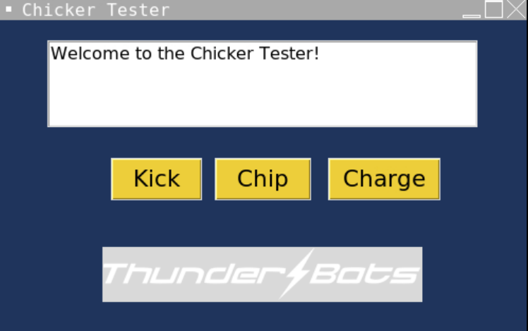
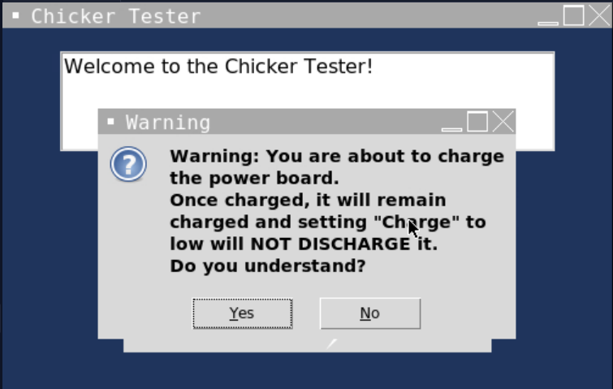
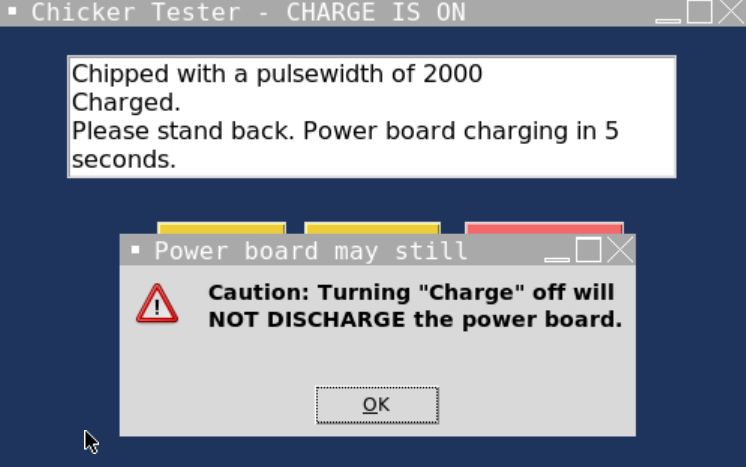
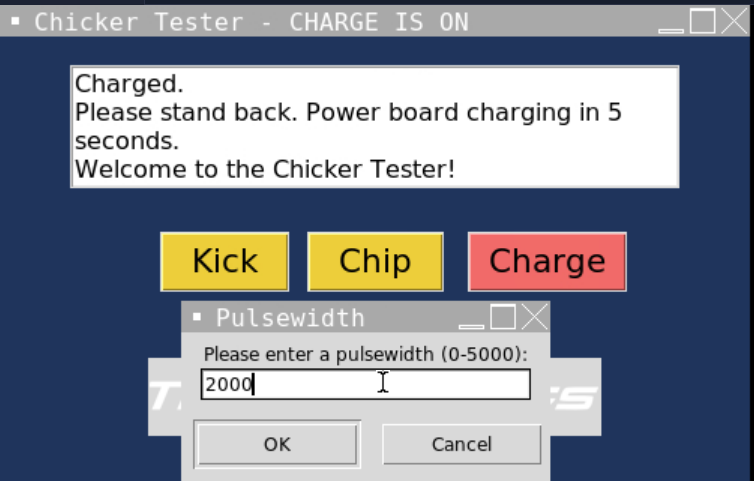

# Chicker
Chip &amp; Kick Tester for UBC Thunderbots. 

This can be run on any device that has Pythn installed.

## Screenshots


This is the home screen, featuring 3 buttons and a log. The log keeps track of which commands have been sent, and is scrollable. 


When the charge button is pressed, a warning message appears before the charge command can be sent to the board. Pressing "No" will cancel the charge command.


When the "Charge" is being turned off, another warning appears. 


When the "Kick" or "Chip" button are pressed, a window appears, asking the user to input the desired pulsewidth. The command will not be sent if the inputted value is not within the boundaries, and the user will need to press the "Kick" or "Chip" button again to re-enter a value.

This image also shows what the GUI looks like when the charge is on. Note that the window title says "CHARGE IS ON" and the charge button is red. 

## Setup
1. Make sure you have Python installed on your device. You will need to run these commands in your terminal to download required libraries.
  ```shell
  pip install pyserial
  pip install Pillow
  ```
2. Upload main.cpp to your ESP32. There are 2 ways.
    - Platform.io (VSCode extension)
      1. Create a new project on Platform.io. 
      2. Clone this entire repository into that folder.
      3. Wait until Platform.io sets up the project configuration. (A new tab should appear automatically) This step takes quite a long time since Platform.io is downloading the ESP32 core (it's a giant library)
      4. Navitage to the src folder and click on "main.cpp". You can upload this code to your board by pressing the "->" button on the bottom bar, or by clicking the dropdown arrow where you usually run your code.
    - Arduino IDE
      1. Go to the src folder and download "main.cpp"
      2. You want to now rename it to "main.ino"
      3. Open "main.ino" in your Arduino IDE
      4. Remove the first line, "#include <Arduino.h>"
      5. You might also need to download the [ESP32 core libraries](https://github.com/espressif/arduino-esp32/tree/master), and add it to your Arduino library folder.
      6. Make sure your ports, board, and other information is correct, then upload. 
  3. Make sure the board is still connected to your laptop. At this time, please close the serial monitor tab (if it is open).
  4. Run "main.py". Another window should appear with the Chicker GUI :)
    - Note: Port autodetection may not always work depending on the board (some boards have really strange names). If that's the case, please hardcode the com port in "main.py"

## Other random things
- The playground folder contains all the WIP files and individual functions. 
- The GUI may look a bit different, depending on where you run it. Either way, it'll still looks like it came from the 2000s.

